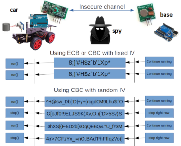
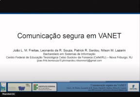
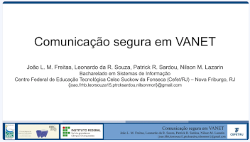

# security-vanets
Trabalho apresentado no Workshop Regional de Segurança da Informação e de Sistemas Computacionais (WRSeg) at XIX Escola Regional de Redes de Computadores (ERRC 2021)

||
|:-:|
|In the context of VANET networks, especially considering their applicability, it is of fundamental importance that the communication between the devices be carried out in a safe environment and without the interference of devices external to this communication. This paper presents the implementation of secure communication through RF modules, using a cryptography library and a message exchange library. Procedures were carried out for the joint operation of these libraries and tests to assess the compliance of the encrypted communication.|

### Whitepaper
|[](https://doi.org/10.5753/errc.2021.18551)|[](https://www.researchgate.net/publication/355748000_Comunicacao_segura_em_VANET)|
|:----:|:----:|
|[Disponível na SOL-SBC](https://doi.org/10.5753/errc.2021.18551)|[Disponível no ResearchGate](https://www.researchgate.net/publication/355748000_Comunicacao_segura_em_VANET)|

### Apresentação na _XIX Escola Regional de Redes de Computadores (ERRC 2021)_
|Vídeo|Slides|
|:-:|:-:|
|[](https://youtu.be/6rAOstaiZbc)|[](https://pt.slideshare.net/slideshow/comunicacao-segura-em-vanet-apresentacao-errc-2021/272938268)|


## COPYRIGHT
<a rel="license" href="http://creativecommons.org/licenses/by/4.0/"></a><br />This library is licensed under a <a rel="license" href="http://creativecommons.org/licenses/by/4.0/">Creative Commons Attribution 4.0 International License</a>. The licensor cannot revoke these freedoms as long as you follow the license terms:

* __Attribution__ — You must give __appropriate credit__ like below:

FREITAS, João L. M.; SOUZA, Leonardo da R.; SARDOU, Patrick R.; LAZARIN, Nilson M.. Comunicação segura em VANET. In: ESCOLA REGIONAL DE REDES DE COMPUTADORES (ERRC), 19. , 2021, Charqueadas/RS. Anais [...]. Porto Alegre: Sociedade Brasileira de Computação, 2021 . p. 109-114. DOI: https://doi.org/10.5753/errc.2021.18551.

<details>
<summary>Bibtex Citation</summary>

```
@inproceedings{errc,
    author = {João Freitas and Leonardo Souza and Patrick Sardou and Nilson Lazarin},
    title = { Comunicação segura em VANET},
    booktitle = {Anais da XIX Escola Regional de Redes de Computadores},
    location = {Charqueadas/RS},
    year = {2021},
    keywords = {},
    issn = {0000-0000},
    pages = {109--114},
    publisher = {SBC},
    address = {Porto Alegre, RS, Brasil},
    doi = {10.5753/errc.2021.18551},
    url = {https://sol.sbc.org.br/index.php/errc/article/view/18551}
}

```	
</details>
